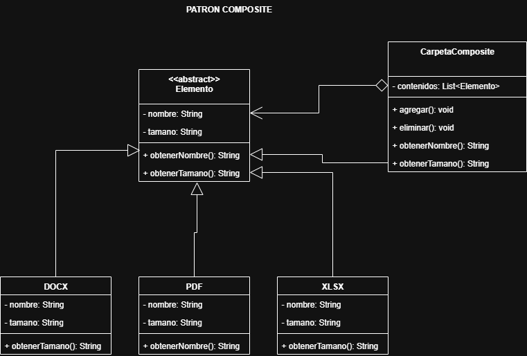

# Patrones Creacionales 
---
## Patrón composite

* Compone objetos en estructuras de árbol para representar jerarquías de parte-todo.
* Permite que los clientes traten de manera uniforme a los objetos individuales y a los compuestos.

---

## Escenario 01:

Supongamos que queremos modelar una jerarquía de archivos. En particular nos interesa el manejo de archivos, carpetas y subcarpetas. Podemos tener los siguientes archivos: PDF, DOCX, XLSX y carpetas. 
Recordando que una carpeta puede tener varios archivos e inclusive subcarpetas, lo que interesa de los archivos/carpetas es que tienen nombre, y tamaño. El tamaño de las carpetas sería la suma de los archivos almacenados internamente.

  
   
  <em>Figura 1: Diagrama del Patrón Composite</em>

